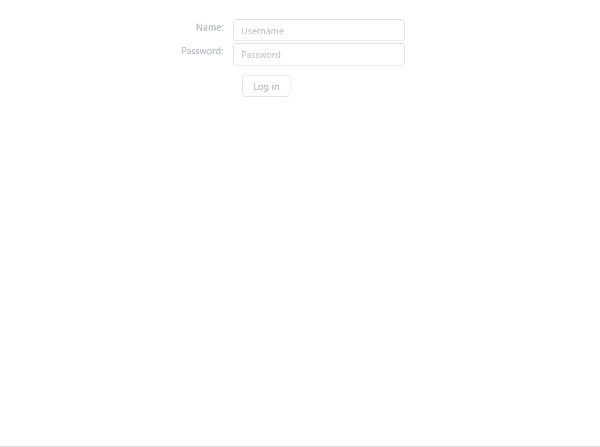

# Customer-specific software versions (CSSV) #
CSSV implemented with the DRY principle in mind, one git repo, one server. The idea is that there are multiple (~10) customer companies and each needs a slightly different version of the same software. This approach outlines how to handle that while repeating NO code at all while allowing arbitrarily fine-grained changes (eg. two versions may differ in a tiny icon at the bottom of the page, that's the finest extreme - or they can render two completely different componets, that's the most coarse extreme).

## Summary ##
- two requests only!
- user logs in, his config is loaded from server, specific application for the user opens
- implemented in React with the help of create-react-app

## How is it done ##
- leverages [webpack's code-splitting](https://webpack.js.org/guides/code-splitting/)
- is inspired by Martin Fowler's [article on feature toggles](https://martinfowler.com/articles/feature-toggles.html), however the difference between CSSV and feature toggles CSSV
is forever, whereas feature toggles are just temporary (usually used for A/B testing and nothing else). 

## TODO ##
- show how testing would work
- consider passing every decision via a prop!
- a strong subfolder structure for decisions!

## Alternatives ##
- fully lazy decisions - load each subcomponent only when it is accessed. This would save bandwith, but I don't care about that really, it's much more important to me that the user doesn't have to wait for multiple loading spinners in a row, that would be very user-unfriendly (for the specific application that I have in mind).

## Side notes ##
- the use of pure JS is for experimental purposes only, a serious application sould use TS or something similar